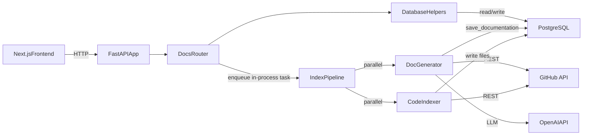
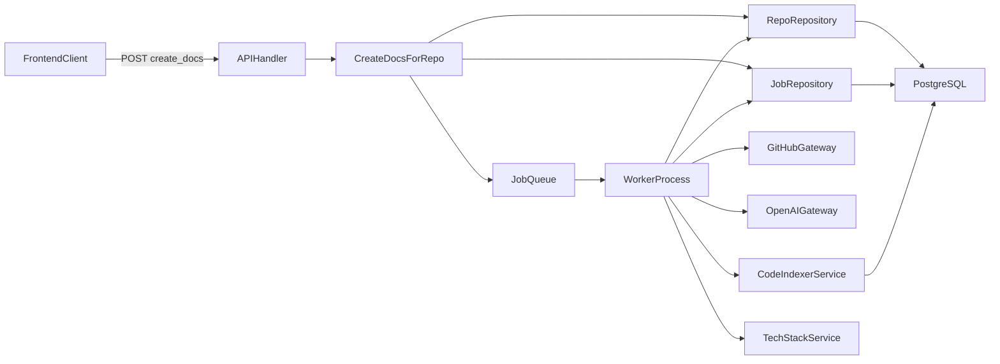

# BitWiki Backend Architecture Plan

## Purpose

This document describes the current backend architecture for BitWiki and lays out a practical target architecture for the next stage of development. The goal is to keep the current product behavior intact while making the backend easier to maintain, safer to operate, and more resilient as repository volume and generation complexity grow.

## Current Architecture

The backend is currently a small FastAPI monolith that coordinates repository validation, documentation generation, file indexing, and repo search. It is organized around a single app entrypoint, one router module, a shared database helper module, and a set of service modules.

### Main components

- `app/main.py`: FastAPI startup, CORS, and router registration
- `app/routers/docs.py`: all HTTP endpoints
- `app/database.py`: SQLAlchemy engine/session setup plus repo/job persistence helpers
- `app/models.py`: ORM models for `repos`, `jobs`, and `files`
 - `app/services/github.py`: GitHub client
- `app/services/doc_generator.py`: OpenAI-backed documentation and diagram generation
- `app/services/code_indexer.py`: source file indexing into Postgres
- `app/services/pipeline.py`: orchestration for parallel doc generation and code indexing
- `app/services/repo_search.py`: in-memory repo suggestion search
- `app/services/tech_stack.py`: tech stack inference for repo badges

### Current runtime flow



### Current strengths

- Simple deploy and simple mental model
- Good fit for an internal MVP
- Async I/O already used for database, GitHub, and OpenAI calls
- Clear end-to-end product flow from repo trigger to stored documentation
- Useful persistence model already exists for repos, jobs, and indexed files

### Current weaknesses

- Background work uses FastAPI `BackgroundTasks`, so server restarts can lose in-flight jobs
- The GitHub client is pinned to a configured organization or owner while routes accept `owner` (or `org`) as input
- `app/database.py` mixes infrastructure setup with business persistence logic
- Schema management relies on `create_all()` plus manual SQL instead of a full migration workflow
- `/repo_suggest` loads all repos into memory on each request
- Pipeline failure semantics are weak because parallel task errors are only logged
- Some legacy sync database code still exists in `doc_generator.py`

## Target Architecture

The recommended target is a modular monolith. The backend should stay as a single codebase and likely a single service for now, but with stronger internal boundaries and durable background processing.

### Target principles

- Keep one backend service until scaling pressure truly requires decomposition
- Separate HTTP concerns from use-case orchestration and infrastructure
- Make background generation durable and retryable
 - Make repository identity consistent across API, database, and GitHub integration
- Use versioned migrations instead of schema creation at startup
- Shift search from in-memory assembly to indexed read models

### Recommended logical layers

- `api`: FastAPI routes, request/response models, auth dependencies, error mapping
- `application`: use-case handlers such as create docs, fetch docs, get job status, suggest repos
- `domain`: core business concepts and rules around repos, jobs, and indexing
- `infrastructure`: database repositories, integration clients, settings, logging, migration wiring
- `workers`: durable asynchronous job execution for generation and indexing
- `services`: pure computation helpers such as tech stack detection and ranking

### Recommended package shape

```text
backend/app/
  api/
    routes/
    dependencies/
    errors/
  application/
    commands/
    queries/
    orchestration/
    dto/
  domain/
    entities/
    policies/
    value_objects/
  infrastructure/
    db/
      models/
      repositories/
      session.py
    github/
    openai/
    search/
    settings.py
    logging.py
  workers/
    jobs/
    queue/
  services/
    tech_stack/
```

## Recommended Data and Control Flows

### Documentation generation flow



### Read/query flow

- `GET /repos`: read from a repo summary query service
 - `GET /fetch_repo_documentation/{owner}/{repo_name}`: read the repo document plus active job state
- `GET /job_status/{job_id}`: read the current worker-owned job status
- `GET /repo_suggest`: query a searchable read model rather than rebuilding an index in memory

## Recommended Structural Changes

### 1. Stabilize module boundaries

The first step is to stop route handlers from directly coordinating low-level persistence and service details.

Recommended changes:

- Move SQLAlchemy engine and session creation into `infrastructure/db/session.py`
- Convert helper functions in `app/database.py` into repository-layer modules or classes
- Move route behavior into application commands and queries
- Keep Pydantic schemas at the API boundary and map to internal DTOs/use-case inputs
- Remove module-level coupling where possible, especially for integration clients

Expected outcome:

- Simpler testing
- Clearer ownership of logic
- Fewer hidden dependencies

### 2. Introduce a durable job system

The current use of in-process background tasks is the biggest operational risk. The next architecture should put generation behind a queue abstraction with a separate worker process.

Recommended job states:

- `queued`
- `running`
- `completed`
- `failed`
- optional `partial_failed`

Recommended job metadata:

- `stage`
- `progress_message`
- `retry_count`
- `last_heartbeat_at`
- `started_at`
- `completed_at`

Expected outcome:

- Jobs survive API restarts
- Easier retries
- Better frontend status reporting
- More reliable failure handling

### 3. Make pipeline stages explicit

The existing pipeline runs doc generation and indexing together, but final state ownership is unclear. Treat the pipeline as a stage-based orchestrator.

Recommended stages:

1. Validate repo
2. Resolve branch
3. Fetch metadata
4. Generate markdown docs
5. Generate architecture diagram
6. Detect tech stack
7. Index repository files
8. Finalize repo and job state

Expected outcome:

- Better observability
- Cleaner retries
- Safer handling of partial failures
- Easier future extension for large-repo strategies

### 4. Normalize repository identity

The backend should treat the following as one canonical repo identity:

- `owner` (organization or user)
- `repo_name`
- `project_url`
- `branch`

Recommended changes:

- Make GitHub requests owner/organization-aware per repo request
- Ensure route parameters, stored values, and GitHub lookups all align
- Centralize repo identity construction in one place

Expected outcome:

- Fewer correctness bugs
- Clearer cross-layer contracts
- Easier future support for multiple owners/providers

### 5. Formalize schema evolution

The backend already includes Alembic as a dependency, but schema management is still effectively manual.

Recommended changes:

- Add proper Alembic configuration and versioned migrations
- Stop relying on `Base.metadata.create_all()` during app startup for ongoing evolution
- Keep startup readiness checks separate from schema migration execution

Expected outcome:

- Reproducible environments
- Safer deployments
- Clear schema history

### 6. Rework search architecture

`/repo_suggest` is currently acceptable for a small repo catalog but will degrade as data grows.

Recommended options:

1. Create a precomputed searchable document per repo in Postgres and query it with trigram or full-text search
2. Add a dedicated `repo_search_index` table maintained during generation

Expected outcome:

- Lower per-request CPU usage
- Faster search response times
- Cleaner separation between write model and read model

## Data Model Direction

The existing tables are a solid base and should remain, but their responsibilities should become more explicit.

### Keep

- `repos`: source of truth for repo metadata and rendered docs
- `jobs`: generation job lifecycle and history
- `files`: indexed repository source code for exploration and search

### Consider adding later

- `repo_search_index`: precomputed searchable content for suggestion queries
- `job_events`: append-only event log for stage changes and failures
- `repo_generation_runs`: optional historical generation snapshots if audits or diffing become useful

## Operational Concerns

### Security

- Add backend authentication before broader exposure
- Tighten CORS configuration
- Validate required environment variables at startup
- Avoid leaking raw internal errors in API responses

-### Reliability

- Add retries with backoff for GitHub and OpenAI calls
- Add request timeouts and failure classification
- Add concurrency controls for generation workers
- Capture structured logs with job correlation IDs

### Observability

- Add structured logging around each pipeline stage
- Expose health/readiness endpoints for API, database, and worker status
- Track job counts, generation latency, failure rate, and indexing volume

## Recommended Implementation Phases

### Phase 1: Boundary refactor

- Introduce `api`, `application`, and `infrastructure` packages
- Move DB setup and persistence helpers into infrastructure
- Add application-layer use cases for current endpoints
 - Fix owner/organization handling in the GitHub integration

### Phase 2: Durable background processing

- Add queue abstraction
- Create worker process
- Move generation and indexing out of FastAPI `BackgroundTasks`
- Add job progress and heartbeat tracking

### Phase 3: Schema and data correctness

- Set up Alembic
- Replace startup schema creation with migrations
- Wire tech stack detection into the generation pipeline
- Clean up legacy sync DB code paths

### Phase 4: Search and indexing optimization

- Replace in-memory repo suggestion assembly
- Add searchable read model
- Track indexing metadata and consider incremental indexing for larger repos

### Phase 5: Security and operations

- Add auth
- Add structured metrics and logging
- Harden error handling and external integration retry behavior

## First Priorities

If only a few architecture improvements can be made soon, the order should be:

1. Fix owner/organization consistency across API and GitHub access
2. Move generation to a durable worker model
3. Introduce real migrations
4. Refactor route logic into application use cases
5. Replace in-memory repo suggestion search

## Summary

BitWiki's backend should remain a modular monolith in the near term. The current stack is appropriate, but it needs stronger internal architecture rather than more services. The most valuable improvements are durable job execution, clearer layering, consistent repository identity, formal migrations, and a more scalable search path.